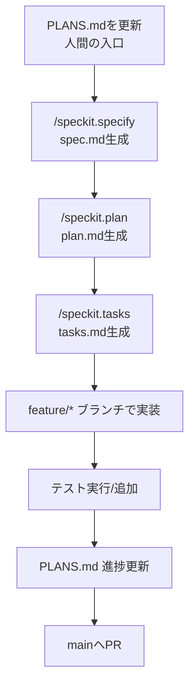

# Contributing Guide

このプロジェクトへのコントリビュートを検討してくれてありがとう 🎉  
以下のルールを守ることで、開発・レビュー・リリースを円滑に進められます。

## 1. 基本方針

- このプロジェクトは **Spec Driven Development** を採用しています。
  - エージェント補助ツールとして Spec Kit を採用
  - > Spec-Driven Development flips the script on traditional software development. For decades, code has been king — specifications were just scaffolding we built and discarded once the "real work" of coding began. Spec-Driven Development changes this: specifications become executable, directly generating working implementations rather than just guiding them. - [github/spec-kit](https://github.com/github/spec-kit?tab=readme-ov-file#-what-is-spec-driven-development)
  - 
- 「動いたからOK」ではなく、**仕様（specs/<feature>/spec.md）を正**とします。
- **PLANS.md が人間のエントリーポイント**。PLANSを見て着手・完了を明示し、spec/tasksと実装を同期します。
- 仕様確認 → 実装 → テスト → PLANS更新の順で整合を取ること。
- 公開物（release ブランチ）の安定性を最優先します。

## 2. 開発前に読むもの

1. `PLANS.md` — 全体計画と進行のエントリーポイント（人間が更新）
2. `specs/<feature>/spec.md` — 仕様と UX のゴール（Spec Kit 生成物）
3. `specs/<feature>/plan.md` / `tasks.md` — 実装計画とタスク分解（半人間・半AI）
4. `src/` の主要ディレクトリ
   - `commands/` 認証・同期・作成系コマンド群
   - `github/` GitHub API とのやり取り・同期キュー
   - `fs/` 仮想ファイルシステム（zenn スキーム）
   - `preview/` zenn CLI を使ったプレビューとプロキシ
   - `ui/` Tree/Search/Actions ビュー、設定パネル、画像挿入
   - `utils/` 共通ユーティリティ
5. `src/__tests__/` — コマンド/FS/Tree のユニットテスト構成

## 3. セットアップとコマンド

- 依存インストール: `pnpm install`
- ビルド: `pnpm run compile`
- テスト: `pnpm test`
- Lint: `pnpm run lint`
- Format: `pnpm run format`
- ウォッチビルド: `pnpm run watch`
- Spec-Kitインストール: `uv tool install specify-cli --from git+https://github.com/github/spec-kit.git`

## 4. ブランチ戦略

### ブランチの役割

| ブランチ        | 用途                |
|-------------|---------------------|
| `main`      | 次期バージョンの開発      |
| `release/*` | 公開・配布用（安定版） |
| `feature/*` | 機能追加            |
| `fix/*`     | バグ修正              |
| `hotfix/*`  | リリース後の緊急修正     |

### 重要なルール

- **直接 `release/*` に PR を出さない**
- すべての変更は `main` を経由する
- タグ（`vX.Y.Z`）は **release ブランチにのみ**打つ

## 5. 仕様（spec.md）について

### 変更が必要なケース
以下に該当する場合は、**必ず `specs/<feature>/spec.md` を先に or 同時に更新**してください。

- 新機能の追加
- 既存挙動の変更
- データ構造・API・設定項目の変更
- ユーザー体験に影響する変更

### 読む順番（推奨）

```

specs/<feature>/spec.md → src/ → tests/

````

## 6. 開発フロー（参考用）

### 新機能追加（PLANS起点のSpec Kitフロー）

```text
PLANS.md 更新（やることを記載）
  ↓
spec 更新（/speckit.specify → /speckit.plan → /speckit.tasks）
  ↓
feature/* ブランチ作成(speckitによって自動的に作成される)
  ↓
実装
  ↓
テスト追加・更新
  ↓
PLANS.md の進捗更新
  ↓
main へ PR
````

#### Mermaidフロー（参考）



### バグ修正

```text
fix/* ブランチ作成
  ↓
再現テスト作成
  ↓
修正
  ↓
main へ PR
```

## 7. 実装ポリシー

- 仕様変更が入る場合は `specs/<feature>/spec.md` を更新し、`tasks.md` まで反映してから実装すること（Spec Kit コマンド推奨）。
- PLANS.md の着手・完了状況を必ず更新し、仕様/実装/テストの整合を記録すること。
- 「spec → code → test」の順で整合を取り、PR/変更理由を明記する。
- GitHub と zenn 関連の設定は `config.ts` と `context.ts`、Tree の状態管理は `ui/tree` で統一する。

## 8. デバッグのヒント

- 仮想 FS のスナップショットや pending sync は `ZennFsProvider` と `GitHubSync` に集約されています。状態が不整合なときはここを確認。
- プレビュー関連のトラブルは `preview/previewManager.ts` と `preview/previewWorkspace.ts` を確認し、プロキシポート取得や zenn CLI の有無をチェック。
- サインイン/リポ設定まわりは `commands/auth.ts` と `ui/actionsView.ts` のコンテキストを確認。

## 9. コーディング規約

- 言語・フレームワーク固有の規約は既存コードに従う
- 意味のないリフォーマットのみの PR は避ける
- ロジック変更には **理由が分かるコメント or commit message** を付ける

## 10. テストについて

- ロジック変更にはテスト追加を推奨
- 既存テストが落ちた場合、修正 or 理由の明示が必要
- CI が失敗している PR は原則マージしません

## 11. Pull Request ルール

### PR 作成時に含めること

- 変更の目的
- spec.md 更新の有無
- 動作確認方法

### PR テンプレート

[.github/ISSUE_TEMPLATE/pull_request_template.md](.github/ISSUE_TEMPLATE/pull_request_template.md)

### Issue テンプレート

- バグ報告: [.github/ISSUE_TEMPLATE/bug_report.md](.github/ISSUE_TEMPLATE/bug_report.md)
- 機能要望: [.github/ISSUE_TEMPLATE/feature_request.md](.github/ISSUE_TEMPLATE/feature_request.md)

---

## 12. リリース/ドキュメント

- Marketplace 向けの README は利用者視点で維持し、開発者向けの注意点は本ファイルに追記する。
- 多言語対応文字列は `package.nls*.json` で管理し、追加時は両方更新する。

## 13. やらないこと

- 仕様を無視した実装
- 意図が説明されていない大規模変更
- 議論なしの破壊的変更

## 14. 不明点がある場合

- Issue を立てて相談してください
- 「こうしたいが方針に合うか？」の相談は歓迎です
