

    
    <h1>📘 ZennPad</h1>
    <h3><em>Zenn をより手軽に、身近に</em></h3>

    <strong>VS Code のサイドバーから Zenn 記事を執筆・管理</strong>

    
    
    
    

ZennPad は、VS Code のサイドバーから Zenn の記事/本/画像をまるごと扱える拡張機能です。GitHub リポジトリを仮想ファイルシステムとして開き、記事のドラフト作成・公開切替・画像挿入・プレビュー・デプロイまでをサイドバー上で行えるようにします。

---

**Table of Contents**

- [🏃Getting Started](#getting-started)
- [✍️記事・本・画像管理](#️記事本画像管理)
- [🧑‍🤝‍🧑リポジトリと同期](#リポジトリと同期)
- [🔍Search ビュー](#search-ビュー)
- [🖼️画像の取り込み](#️画像の取り込み)
- [🛰️プレビューとデプロイ](#️プレビューとデプロイ)
- [🎯Actions ビュー](#actions-ビュー)
- [⏯️ Appendix: Contributed Commands](#️-appendix-contributed-commands)
- [📋 Appendix: Configuration Settings](#-appendix-configuration-settings)
- [開発](#開発)
- [ライセンス](#ライセンス)

---

## 🏃Getting Started

1. マーケットプレイスから ZennPad をインストールします。
2. アクティビティバーのノートブックアイコンから `ZennPad` タブを開き、`ZennPad: Sign in to GitHub` で認証します。

   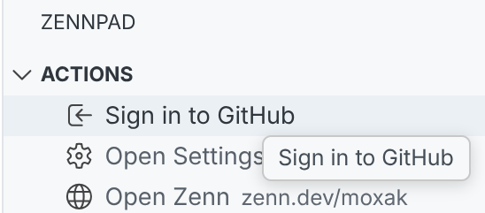

3. `zennpad.githubOwner` / `zennpad.githubRepo`（必要に応じて `zennpad.workBranch`）を設定するか、`ZennPad: Choose GitHub Repository` で対象リポジトリを選択します。

   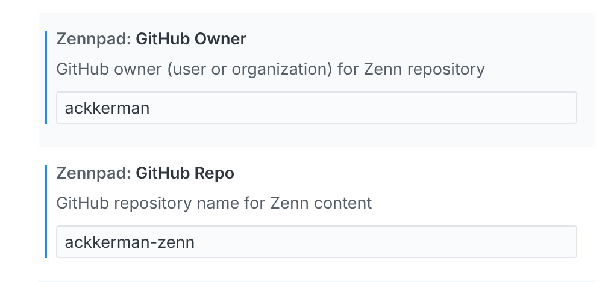

4. `ZennPad: Refresh` でリポジトリ構造（articles/drafts/books/images/files）を取得し、ツリーから編集を始めます。

   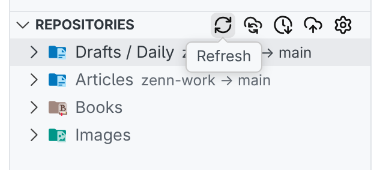

5. 画像を挿入する場合は Markdown に貼り付け/ドラッグ＆ドロップするか、`ZennPad: Insert Image from File` を実行します。 ([👉 画像の取り込み - ZennPad](#🖼️画像の取り込み))

6. プレビューしたい場合は `zenn` CLI をインストール済みであることを確認し、`ZennPad: Preview` を実行してください。

> [!IMPORTANT]
> 本リポジトリは、Zenn が公式に提供している **GitHub 連携機能**を前提に動作します。  
> 連携方法の詳細は、Zenn 公式ドキュメントを参照してください。  
> 関連: 👉 [アカウントにGitHubリポジトリを連携してZennのコンテンツを管理する](https://zenn.dev/zenn/articles/connect-to-github)

---

## ✍️記事・本・画像管理

ZennPad では Articles/Drafts/Books/Images/Files を Repositories ビューでツリー表示します。コンテキストメニューからリネーム・複製・削除、Zenn/GitHub へのリンクコピーやブラウザーオープンが可能です。

- **新規作成**: `ZennPad: New Article` は日付入り slug と frontmatter を自動生成します。Book/Chapter も同様にテンプレート付きで作成できます。
  
  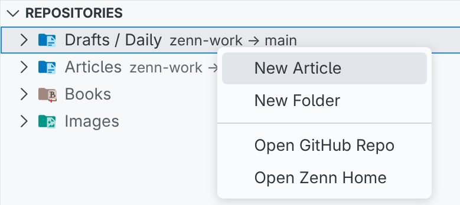

- **公開/非公開の切替**: `ZennPad: Publish Article` / `Unpublish Article` で frontmatter の `published` をトグルし、`Open on Zenn` から公開 URL をブラウザーで開けます。

  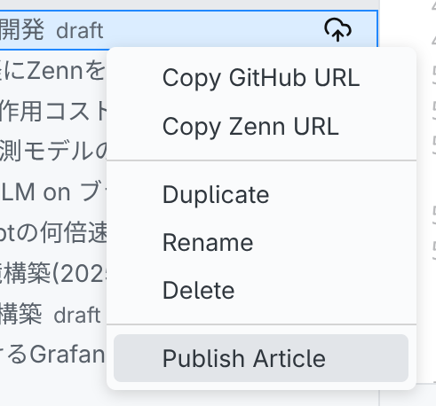

- **並び替え**: ツールバーの切替で記事を日付/タイトル順に並べ替えられます。
- **リンク操作**: 任意のノードから Zenn/GitHub URL、絶対/相対パスをコピーできます。
- **ドラフト管理**: Drafts 配下のコンテンツもツリー上で同じ操作が可能です。

  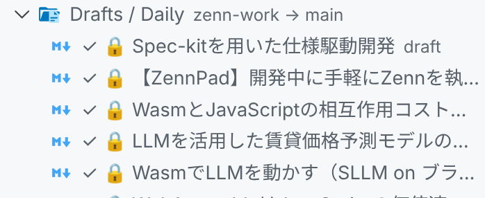

> [!TIP]
> **ドラフトはタイトルの横に鍵アイコンが表示されます**
>
> 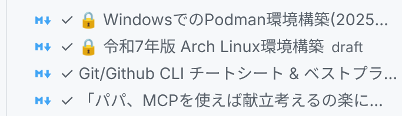

## 🧑‍🤝‍🧑リポジトリと同期

ZennPad は GitHub Contents API を使ってリポジトリを仮想ファイルシステムとして扱います。ローカルに clone することなく、ブランチと同期しながら編集できます。

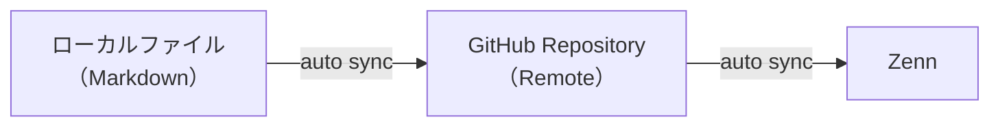

- **サインインと選択**: `ZennPad: Sign in to GitHub` で GitHub 認証し、`ZennPad: Choose GitHub Repository` で対象を選択。
- **自動同期**: `zennpad.workBranch`（デフォルト `zenn-work`）に自動で反映し、ステータスバーから一時停止/再開が可能。`ZennPad: Flush Pending Sync` で保留キューを即座にフラッシュできます。
- **デプロイ**: `Deploy to Zenn` コマンドで work ブランチから main ブランチへ反映し、Zenn 側に公開します。
- **設定パネル**: Actions ビューの Settings から owner/repo/branch/zennAccount を GUI で変更できます。

関連: 👉 [アカウントにGitHubリポジトリを連携してZennのコンテンツを管理する(https://zenn.dev/zenn/articles/connect-to-github)](https://zenn.dev/zenn/articles/connect-to-github)

## 🔍Search ビュー

Search ビューはファイル名/タイトル/本文を横断検索できる Webview です。ケース/単語/正規表現トグルを備え、結果から直接ファイルを開けます。

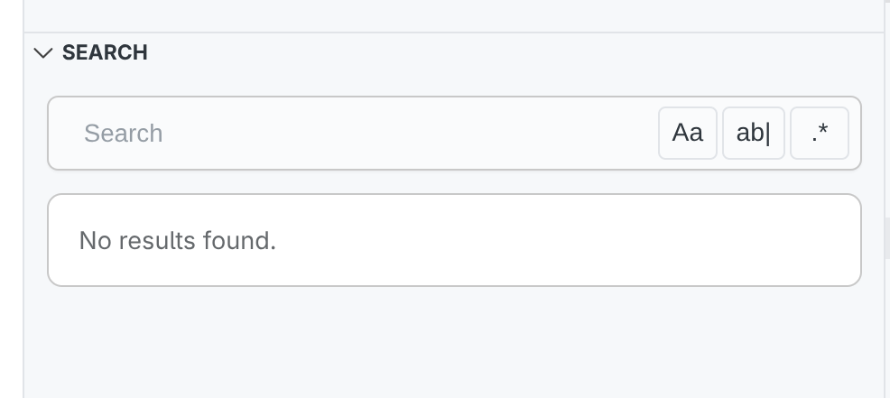

**検索結果**

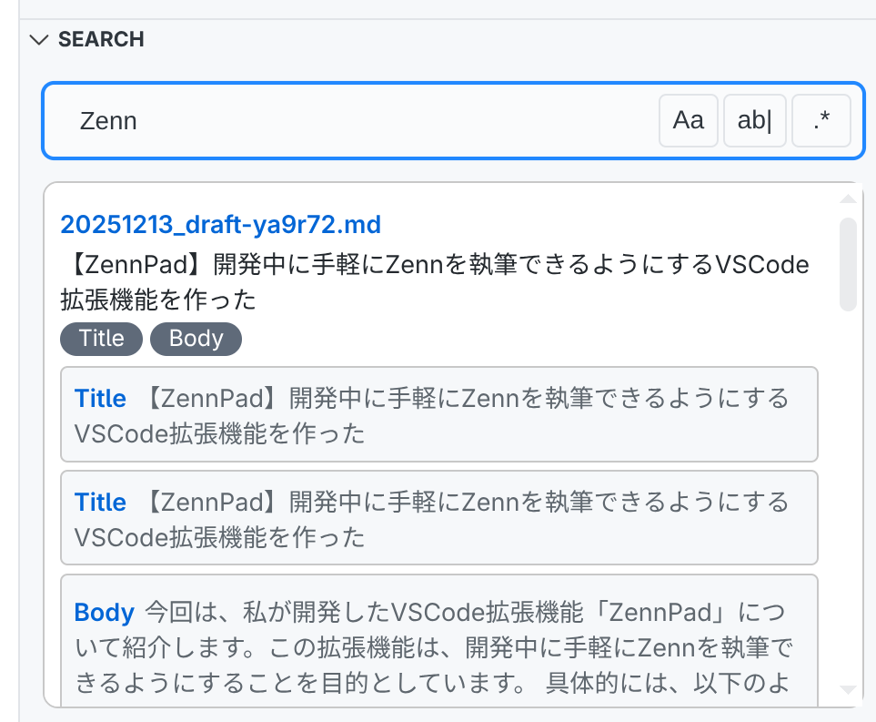

## 🖼️画像の取り込み

Markdown への貼り付けやドラッグ＆ドロップを検知し、画像を `/images/<timestamp>.<ext>` に保存して `` を自動挿入します。`ZennPad: Insert Image from File` でファイル選択からの挿入も可能です。

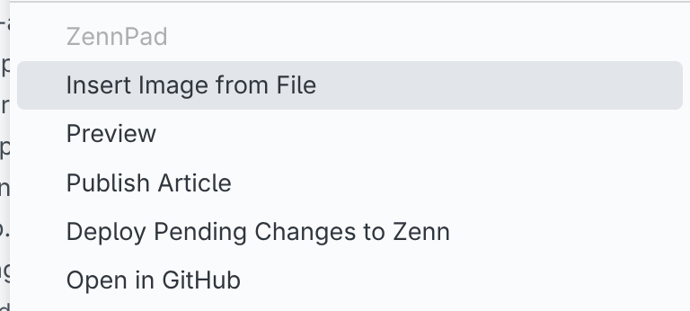

- **挿入方法**:
  - ショートカットキー: `Ctrl+V`
  - コマンド: `ZennPad: Insert Image from File`
  - コンテキストウィンドウ: `Insert Image from File`
- **パス操作**: Zennの画像ファイル配置ルールに従い、画像が配置され、自動的に適したパスが入力されます。

> [!IMPORTANT]
> 
> **画像ファイルはリポジトリ直下の /images ディレクトリに配置します。**
> 
> 関連: 👉 [GitHubリポジトリ連携で画像をアップロードする方法](https://zenn.dev/zenn/articles/deploy-github-images)
> 
> 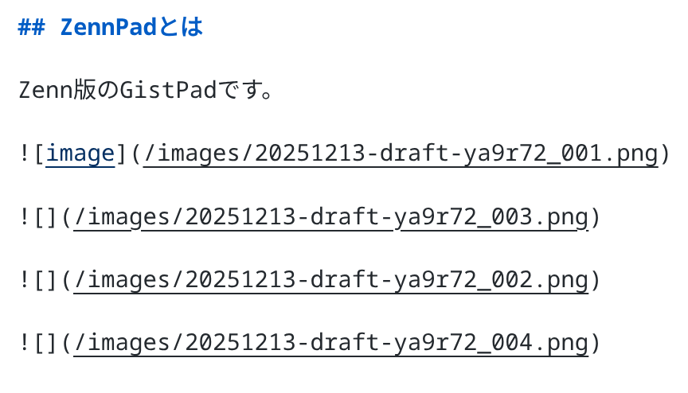

## 🛰️プレビューとデプロイ

`ZennPad: Preview` を実行すると、アクティブな Markdown を同期しつつ、プレビューを表示します。`/images` へのリクエストもローカルで解決されるため、ドラフト中でも正確な見た目を確認できます。

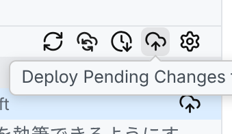

> [!TIP]
> **Zennからデプロイ状況を確認する** ([デプロイ履歴 - zenn.dev](https://zenn.dev/dashboard/deploys?deployments_history))
>
> 1. デプロイ中
>
>    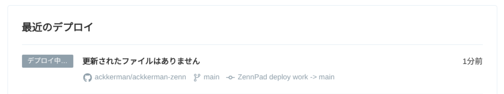
>
> 2. デプロイ成功
>
>    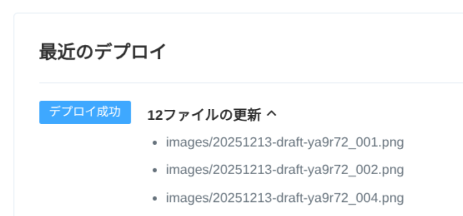
>
> 関連: 👉 [GitHubリポジトリ連携についてのFAQ(https://zenn.dev/zenn/articles/connect-to-github)](https://zenn.dev/zenn/articles/connect-to-github#github%E3%83%AA%E3%83%9D%E3%82%B8%E3%83%88%E3%83%AA%E9%80%A3%E6%90%BA%E3%81%AB%E3%81%A4%E3%81%84%E3%81%A6%E3%81%AEfaq)

## 🎯Actions ビュー

Actions ビューはクイックアクセスランチャーです。サインイン、設定パネル、Zenn プロフィール、ヘルプガイド（外部サイト or プレビュー deep link）への導線をまとめています。

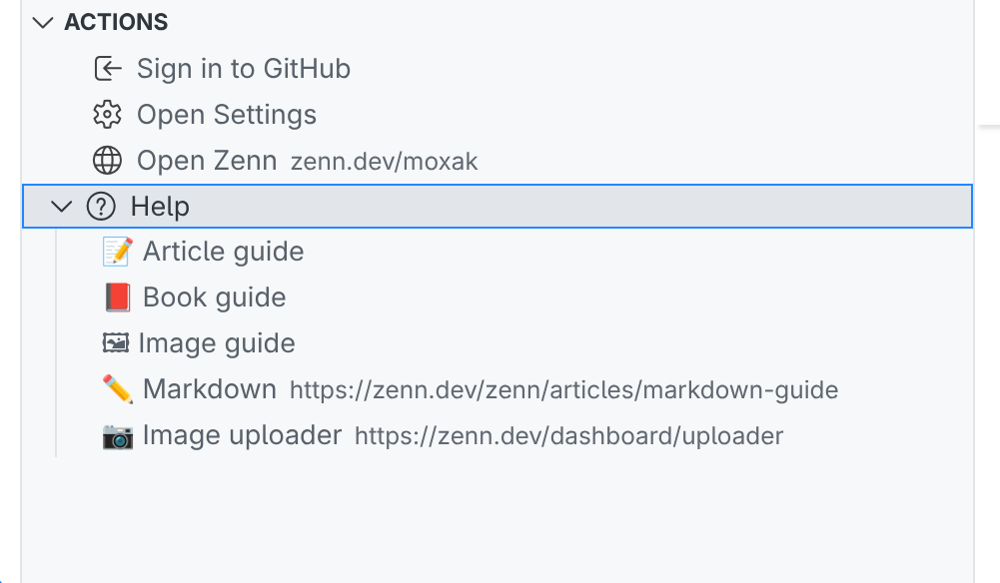

---

## ⏯️ Appendix: Contributed Commands
  
- `ZennPad: Sign in to GitHub` / `Sign out of GitHub` - GitHub 認証の開始と解除
- `ZennPad: Choose GitHub Repository` - 対象リポジトリを Quick Pick で選択
- `ZennPad: Refresh` - GitHub から最新の articles/books/images を取得
- `ZennPad: New Article` / `New Book` / `New Chapter` - テンプレート付きで新規作成
- `ZennPad: Publish Article` / `Unpublish Article` - frontmatter の `published` をトグル
- `ZennPad: Preview` - zenn CLI バックエンドで Webview プレビューを開く
- `ZennPad: Insert Image from File` - ローカル画像を `/images` に保存し Markdown を挿入
- `ZennPad: Deploy to Zenn` - work ブランチから main ブランチへデプロイ
- `ZennPad: Flush Pending Sync` - 保留中の同期を強制フラッシュ
- `ZennPad: Pause Auto Sync` / `Resume Auto Sync` - 自動同期の一時停止/再開
- `ZennPad: Copy Zenn URL` / `Copy GitHub URL` - 選択中コンテンツのリンクをコピー
- `ZennPad: Sort Articles by Date` / `Sort Articles by Title` - 記事ツリーの並び順を切替

## 📋 Appendix: Configuration Settings

- `zennpad.githubOwner` - Zenn 用リポジトリの GitHub オーナー（ユーザーまたは org）
- `zennpad.githubRepo` - Zenn 用リポジトリ名
- `zennpad.githubBranch` - デプロイ先のメインブランチ（デフォルト: `main`）
- `zennpad.workBranch` - 編集内容を自動同期するワークブランチ（デフォルト: `zenn-work`）
- `zennpad.zennAccount` - Zenn アカウント（`zenn.dev/{username}`）。空の場合は `githubOwner` を使用

## 開発

開発環境のセットアップやコントリビュート手順は [`CONTRIBUTING.md`](./CONTRIBUTING.md) を参照してください。ビルド/テスト/フォーマット用の npm スクリプトは [`package.json`](./package.json) にまとまっています。

## ライセンス

[MIT](LICENSE)
